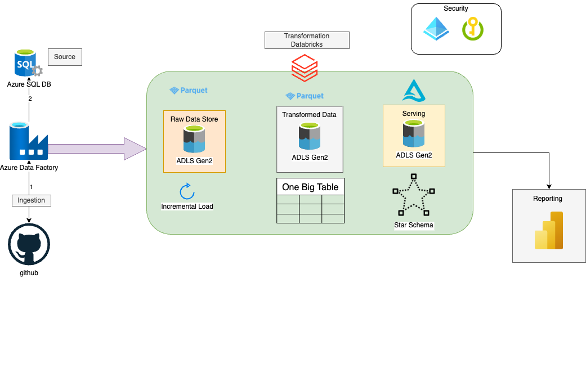
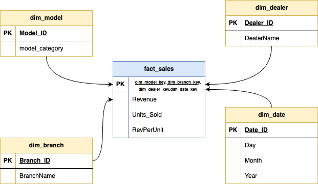

# 🚀 Car Sales Data Engineering Project

This project demonstrates a modern Azure-based data engineering pipeline using services like Azure Data Factory, Azure Databricks (Inckuding Unity Catalog, Databricks Pipeline), ADLS Gen2, and Power BI.

---

## 🧭 Project Design Architecture

<!-- You can replace with a URL or GitHub path like:

-->

---

## ⭐ Star Schema (Data Warehouse Model)

---
